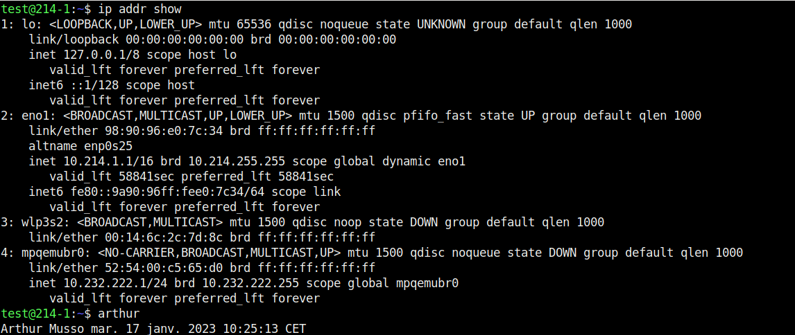
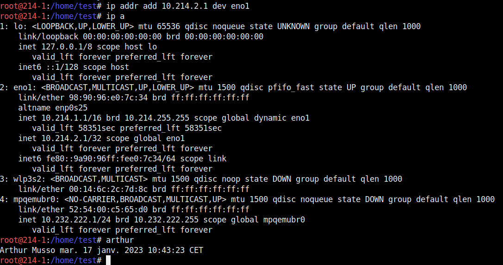
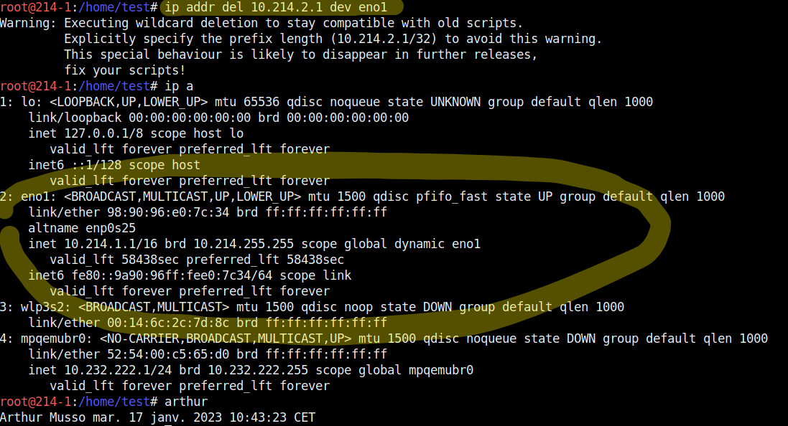
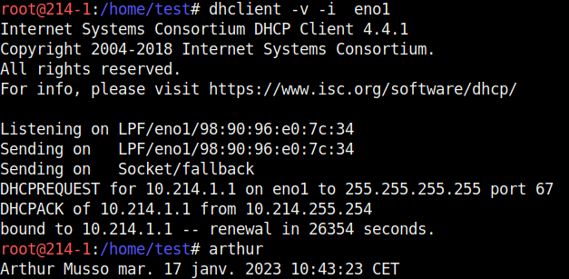

# DICTIONNAIRE DES COMMANDES RESEAUX ET OS SUR LINUX ET WINDOWS

## Présentation :
Dans ce doccument vous allez pouvoir retrouver toutes les commande réseau et OS les plus utilisé sous linux et windows.
## Sommaire :
* [Commandes Réseaux](#commandes-réseau)
* [Commandes OS](#commandes-os)

# Commandes Réseau
|LINUX | RACCOURCI | WINDOWS 
|-|-|-|
[ip addr show](#ip-addr-show)|ip a|[if config](#if-config)
[ping '@ip'](#ping-@ip)||[ping '@ip'](#ping-ip-1)
[ip addr add '@ip' dev "Nom De Votre Interface"](#ip-addr-add-ip-dev-nom-de-votre-interface)|ip a a ‘@ip’ dev "Nom De Votre Interface"|[netsh interface ip set address name="interface" static '@ip' masque '@DNS'](#netsh-interface-ip-set-address-nameinterface-static-ip-masque-dns)
[ip addr del ‘@ip’ dev "Nom De Votre Interface"](#ip-addr-del-ip-dev-nom-de-votre-interface)|ip a del ‘@ip’ dev "Nom De Votre Interface"|[ipconfig /release](#ipconfig-release)
[dhclient](#dhclient)||[ipconfig /renew](#ipconfig-renew)
[ip link set up dev "Nom De Votre Interface"](#ip-link-set-up-dev-nom-de-votre-interface)|ip l s up dev "Nom De Votre Interface"|[netsh int set int name="NomCarteReseau" admin=enable](#netsh-int-set-int-namenomcartereseau-adminenable)
[ip link set down dev "Nom De Votre Interface"](#ip-link-set-down-dev-nom-de-votre-interface)|ip l s down dev "Nom De Votre Interface"|[netsh int set int name="NomCarteReseau" admin=disable](#netsh-int-set-int-namenomcartereseau-admindisable)
[ip route add default via ‘@ip’ dev "Nom De Votre Interface"](#ip-route-add-default-via-ip-dev-nom-de-votre-interface)|ip r a default via ‘@ip’ dev "Nom De Votre Interface"|[route ADD 0.0.0.0 MASK](#route-add-0000-mask)
[ip route flush dev "Nom De Votre Interface"](#ip-route-flush-dev-nom-de-votre-interface)|ip r flush dev "Nom De Votre Interface"|[route delete 0.0.0.0](#route-delete-0000)
[mii-tool -w "Nom De Votre Interface"](#mii-tool--w-nom-de-votre-interface)||Pas de commande équivalente
[ip link show "Nom De Votre Interface"](#ip-link-show-nom-de-votre-interface)||[ifconfig /all](#ifconfig-all)
[ip addr flush dev "Nom De Votre Interface"](#ip-addr-flush-dev-nom-de-votre-interface)|ip a flush dev "Nom De Votre Interface"|[ipconfig /release](#ipconfig-release-1)
[ip neighbour](#ip-neighbour)|ip n|[arp](#arp)
[ip neighbour flush all](#ip-neighbour-flush-all)|ip n flush all|[arp -d](#arp--d)
[ifconfig](#ifconfig)||[encours1](#encours1)
[traceroute @'ip'](#traceroute-ip)||[tracert @'ip'](#tracert-ip)
[host](#host)||[encours2](#encours2)
[netstat](#netstat)||[netstat](#netstat-1)
[telnet](#telnet)||[telnet](#telnet-1)

# Commandes OS
| LINUX | RACCOURCI | WINDOWS
|-|-|-|
cd||
ls||

# Détail et utilisations des commandes Linux :

## <u>ip addr show</u>
#### Affiche toute la configuration réseau (Adresse IP, nom des interfaces, etc…)

## <u>ping @ip</u>
#### Envoie des paquets icmp à l’adresse donnée. On peut l’utiliser pour voir si une machine est bien connectée au réseau.

## <u>ip addr add '@ip' dev "Nom De Votre Interface"</u>
#### Permet d’ajouter une adresse IP à votre machine. Avec ip a on peut voir que l’adresse IP a bien été ajoutée à l’interface demandé.

## <u>ip addr del ‘@ip’ dev "Nom De Votre Interface"</u>
#### Permet de supprimer une adresse ip précise.

## <u>dhclient</u>
#### dhclient fonctionne sur le modèle client-serveur. Un serveur qui détient la politique d’attribution des configurations IP envoie une configuration au client pour une durée donnée.

## <u>ip link set up dev "Nom De Votre Interface"</u>
#### Cette commande permet d’activer la carte réseau demandée.

## <u>ip link set down dev "Nom De Votre Interface"</u>
#### Cette commande permet d’éteindre la carte réseau demandée.

## <u>ip route add default via ‘@ip’ dev "Nom De Votre Interface"</u>
#### Cette commande permet d’ajouter une route par défaut.

## <u>ip route flush dev "Nom De Votre Interface"</u>
#### Suprimme toutes les routes, default et static.

## <u>mii-tool -w "Nom De Votre Interface"</u>
#### Permet de voir l’état de la liaison link ok/link no. Si la carte réseau est bien branchée sur le réseau.

## <u>ip link show "Nom De Votre Interface"</u>
#### Pour regarder l’état de la carte réseau.

## <u>ip addr flush dev "Nom De Votre Interface"</u>
#### Supprime les adresses IP de cette interface.

## <u>ip neighbour</u>
#### Permet de voir le cache ARP.

## <u>ip neighbour flush all</u>
#### Permet de supprimer le cache ARP.

## <u>ifconfig</u>
#### 

## <u>traceroute @'ip'</u>
#### 

## <u>host</u>
#### 

## <u>netstat</u>
#### 

## <u>telnet</u>
#### 

# Détail et utilisations des commandes Windows :

## <u>if config</u>

## <u>ping '@ip'</u>

## <u>netsh interface ip set address name="interface" static '@ip' masque '@DNS'</u>

## <u>ipconfig /release</u>

## <u>ipconfig /renew</u>

## <u>netsh int set int name="NomCarteReseau" admin=enable</u>

## <u>netsh int set int name="NomCarteReseau" admin=disable</u>

## <u>route ADD 0.0.0.0 MASK</u>

## <u>route delete 0.0.0.0</u>

## <u>ifconfig /all</u>

## <u>ipconfig /release</u>

## <u>arp</u>

## <u>arp -d</u>

## <u>encours1</u>

## <u>tracert @'ip'</u>

## <u>encours2</u>

## <u>netstat</u>

## <u>telnet</u>