# DICTIONNAIRE DES COMMANDES RESEAUX ET OS SUR LINUX ET WINDOWS

## Présentation :
Dans ce doccument vous allez pouvoir retrouver toutes les commande réseau et OS les plus utilisé sous linux et windows.
## Sommaire :
* [Commandes Réseaux](#commandes-réseau)
* [Commandes OS](#commandes-os)
* [Installation de Windows sur une VM]

# Commandes Réseau
|LINUX | RACCOURCI | WINDOWS 
|-|-|-|
[ip addr show](#ip-addr-show)|ip a|[ipconfig](#ipconfig)
[ping '@ip'](#ping-ip)||[ping '@ip'](#ping-ip-1)
[ip addr add '@ip' dev "Nom De Votre Interface"](#ip-addr-add-ip-dev-nom-de-votre-interface)|ip a a ‘@ip’ dev "Nom De Votre Interface"|[netsh interface ip set address name="interface" static '@ip' masque '@DNS'](#netsh-interface-ip-set-address-nameinterface-static-ip-masque-dns)
[ip addr del ‘@ip’ dev "Nom De Votre Interface"](#ip-addr-del-ip-dev-nom-de-votre-interface)|ip a del ‘@ip’ dev "Nom De Votre Interface"|[ipconfig /release](#ipconfig-release)
[dhclient](#dhclient)||[ipconfig /renew](#ipconfig-renew)
[ip link set up dev "Nom De Votre Interface"](#ip-link-set-up-dev-nom-de-votre-interface)|ip l s up dev "Nom De Votre Interface"|[netsh int set int name="NomCarteReseau" admin=enable](#netsh-int-set-int-namenomcartereseau-adminenable)
[ip link set down dev "Nom De Votre Interface"](#ip-link-set-down-dev-nom-de-votre-interface)|ip l s down dev "Nom De Votre Interface"|[netsh int set int name="NomCarteReseau" admin=disable](#netsh-int-set-int-namenomcartereseau-admindisable)
[ip route add default via ‘@ip’ dev "Nom De Votre Interface"](#ip-route-add-default-via-ip-dev-nom-de-votre-interface)|ip r a default via ‘@ip’ dev "Nom De Votre Interface"|[route ADD 0.0.0.0 MASK](#route-add-0000-mask)
[ip route flush dev "Nom De Votre Interface"](#ip-route-flush-dev-nom-de-votre-interface)|ip r flush dev "Nom De Votre Interface"|[route delete 0.0.0.0](#route-delete-0000)
[mii-tool -w "Nom De Votre Interface"](#mii-tool--w-nom-de-votre-interface)||Pas de commande équivalente
[ip link show "Nom De Votre Interface"](#ip-link-show-nom-de-votre-interface)||[ifconfig /all](#ifconfig-all)
[ip addr flush dev "Nom De Votre Interface"](#ip-addr-flush-dev-nom-de-votre-interface)|ip a flush dev "Nom De Votre Interface"|[ipconfig /release](#ipconfig-release-1)
[ip neighbour](#ip-neighbour)|ip n|[arp](#arp)
[ip neighbour flush all](#ip-neighbour-flush-all)|ip n flush all|[arp -d](#arp--d)
[ifconfig](#ifconfig)||[encours1](#encours1)
[traceroute @'ip'](#traceroute-ip)||[tracert @'ip'](#tracert-ip)
[host](#host)||[encours2](#encours2)
[netstat](#netstat)||[netstat](#netstat-1)
[telnet](#telnet)||[telnet](#telnet-1)

# Commandes OS
| LINUX | RACCOURCI | WINDOWS
|-|-|-|
cd||
ls||

# Détail et utilisations des commandes Linux :

## ip addr show
#### Affiche toute la configuration réseau (Adresse IP, nom des interfaces, etc…)

## ping @ip
#### Envoie des paquets icmp à l’adresse donnée. On peut l’utiliser pour voir si une machine est bien connectée au réseau.

## ip addr add '@ip' dev "Nom De Votre Interface"
#### Permet d’ajouter une adresse IP à votre machine. Avec ip a on peut voir que l’adresse IP a bien été ajoutée à l’interface demandé.
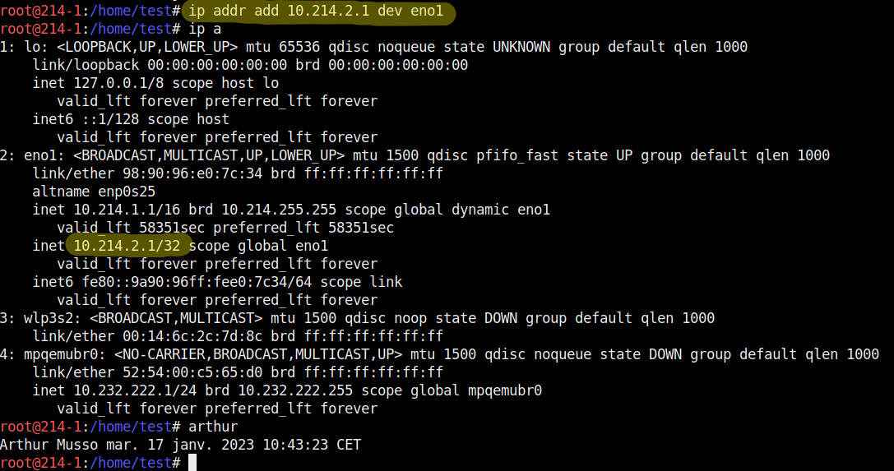

## ip addr del ‘@ip’ dev "Nom De Votre Interface"
#### Permet de supprimer une adresse ip précise.

## dhclient
#### dhclient fonctionne sur le modèle client-serveur. Un serveur qui détient la politique d’attribution des configurations IP envoie une configuration au client pour une durée donnée.

## ip link set up dev "Nom De Votre Interface"
#### Cette commande permet d’activer la carte réseau demandée.
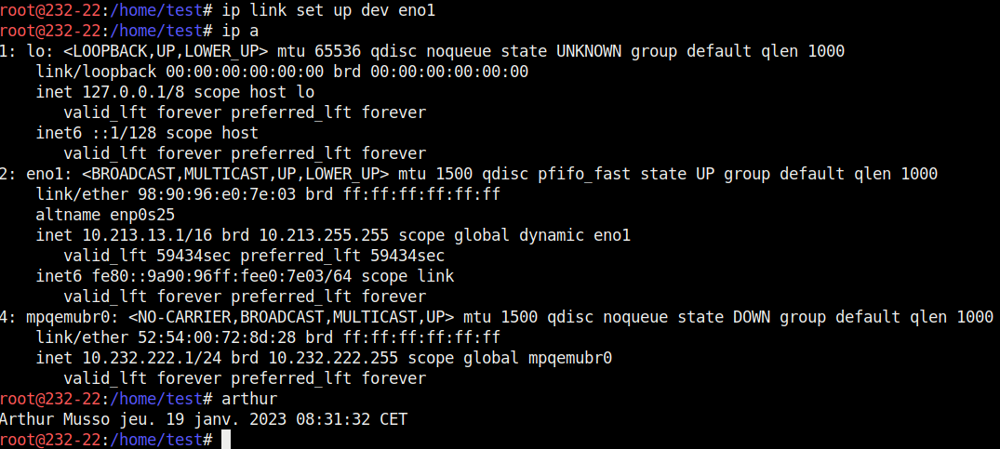

## ip link set down dev "Nom De Votre Interface"
#### Cette commande permet d’éteindre la carte réseau demandée.
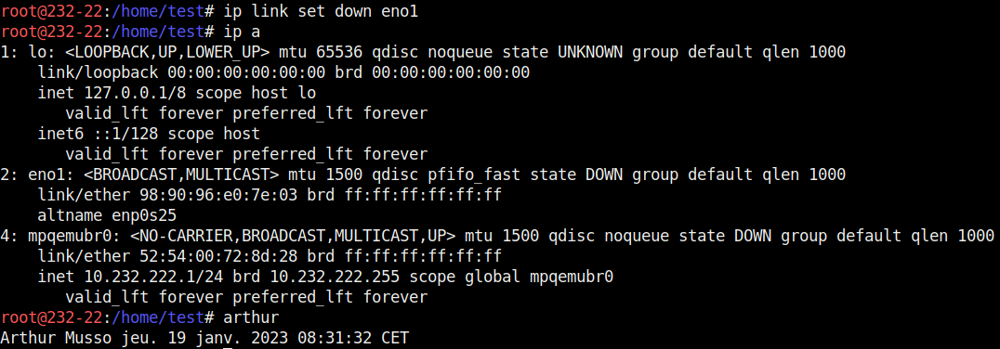

## ip route add default via ‘@ip’ dev "Nom De Votre Interface"
#### Cette commande permet d’ajouter une route par défaut.
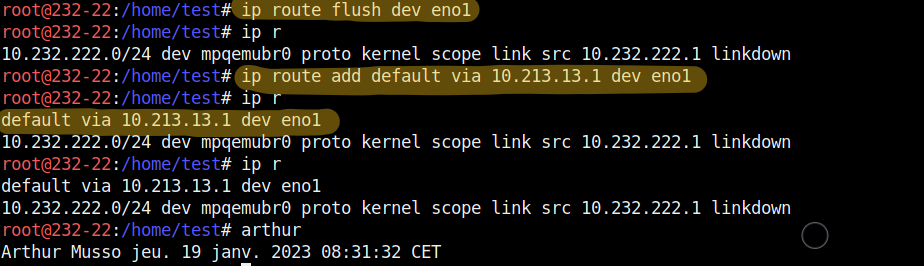

## ip route flush dev "Nom De Votre Interface"
#### Suprimme toutes les routes, default et static.
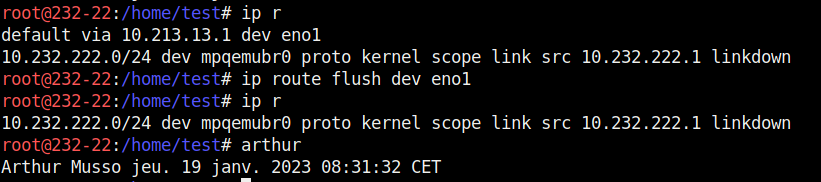

## mii-tool -w "Nom De Votre Interface"
#### Permet de voir l’état de la liaison link ok/link no. Si la carte réseau est bien branchée sur le réseau.
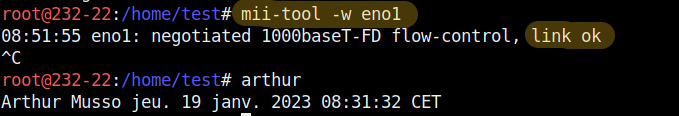

## ip link show "Nom De Votre Interface"
#### Pour regarder l’état de la carte réseau.

## ip addr flush dev "Nom De Votre Interface"
#### Supprime les adresses IP de cette interface.
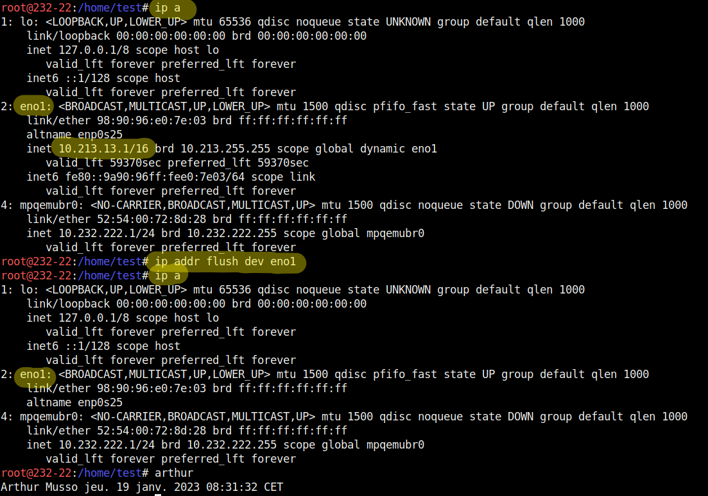

## ip neighbour
#### Permet de voir le cache ARP.
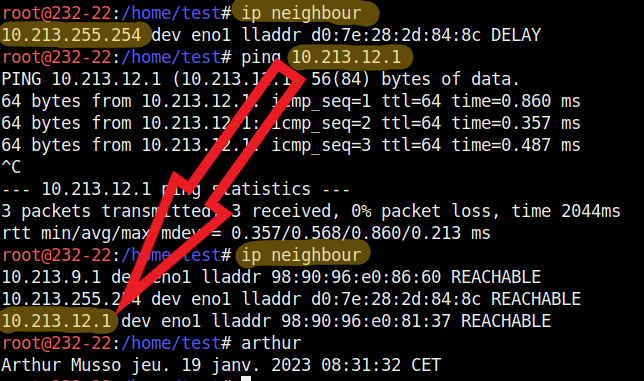

## ip neighbour flush all
#### Permet de supprimer le cache ARP.
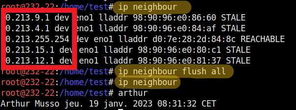

## ifconfig
####
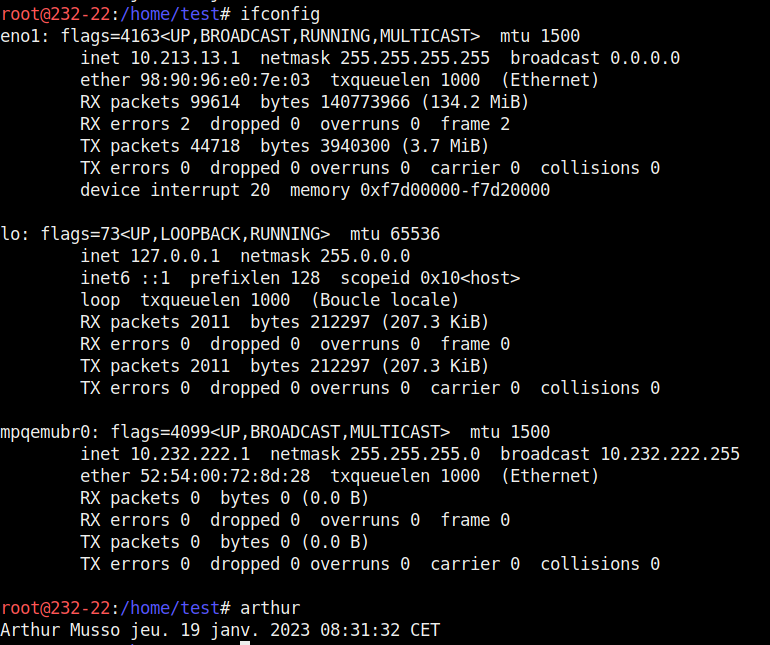

## traceroute @'ip'
####
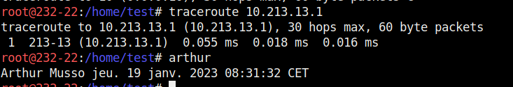

## host
#### 

## netstat
#### 

## telnet
####

# Détail et utilisations des commandes Windows :

## ipconfig
#### Cette commande affiche la configuration IP
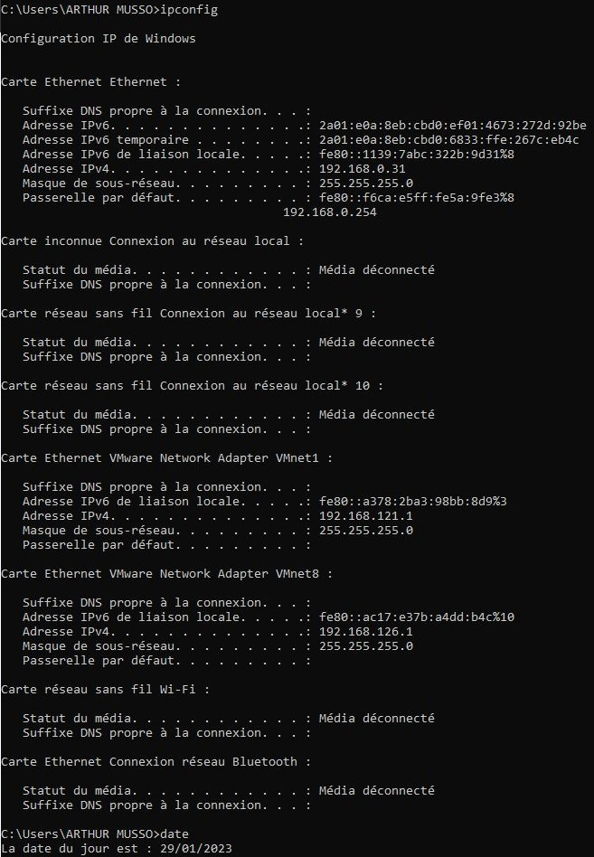

## ping '@ip'
#### Envoie des paquets icmp à l’adresse donnée. On peut l’utiliser pour voir si une machine est bien connectée au réseau.

## netsh interface ip set address name="interface" static '@ip' masque 'Gateway'
#### Cette commande permet d'ajouter une addresse IP sur l'interface choisie (ici 'Ethernet') en Static ou Dynamique. La commande necessite l'addresse IP voulu, son masque et la passerelle.
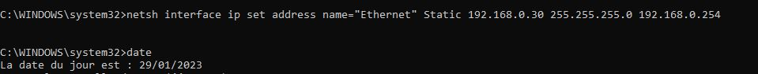
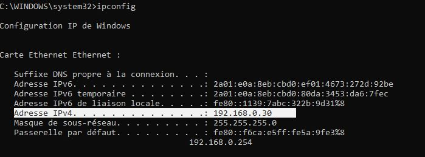

## ipconfig /release
#### Cette commande permet de libérer' une adresse IP (dynamique) attribuée.
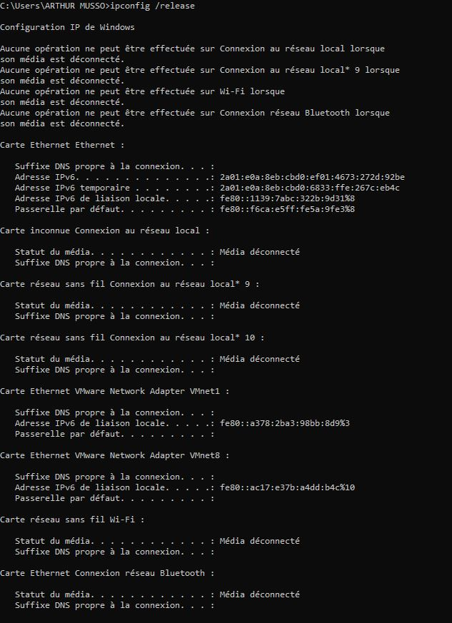

## ipconfig /renew
#### Cette commande permet de réatribuer' une adresse IP (dynamique).
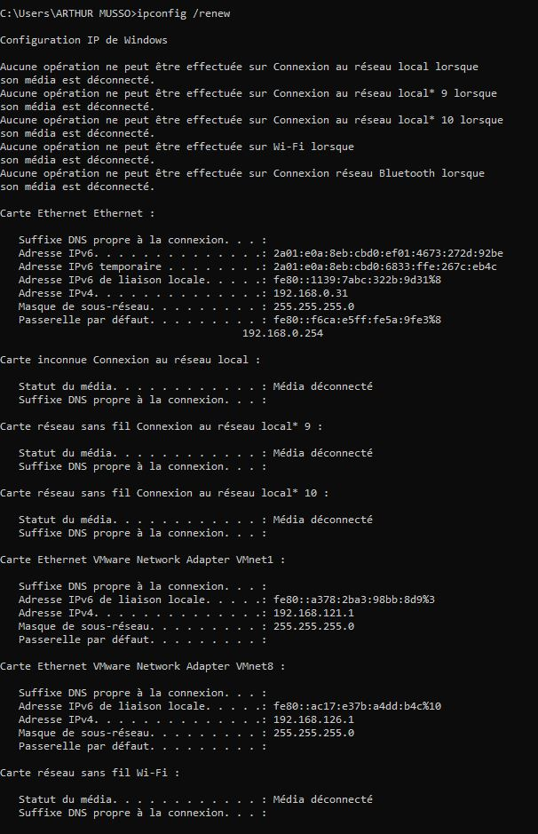

## netsh int set int name="NomCarteReseau" admin=enable
#### Cette commande permet d'activer la carte réseau (ici'Ethernet').
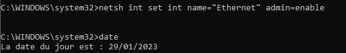

## netsh int set int name="NomCarteReseau" admin=disable
#### Cette commande permet de désactiver la carte réseau (ici'Ethernet').
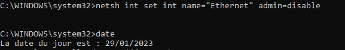

## route ADD 0.0.0.0 MASK
#### Cette commande permet d'ajouter une route
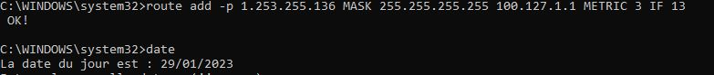

## route delete 0.0.0.0
#### Cette commande permet de suprimer une route.
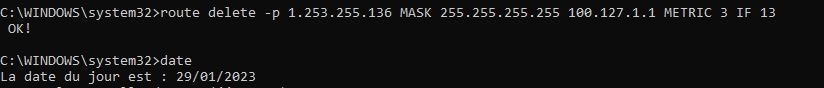

## ifconfig /all
#### Cette commande permet d'avoir les informations détaillées de toutes les cartes réseau.
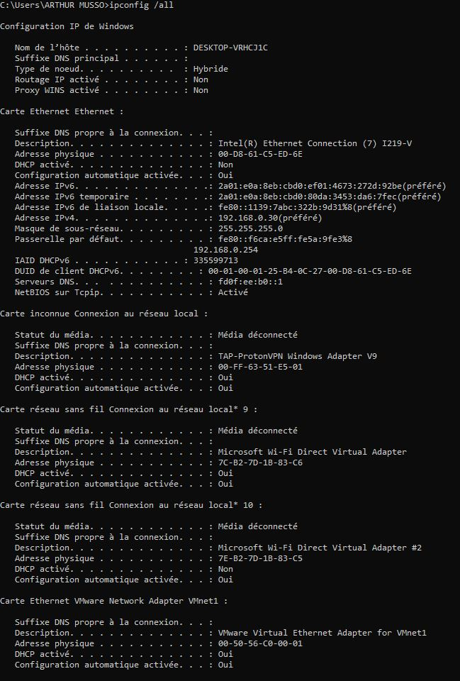

## ipconfig /release
#### Cette commande permet de libérer' une adresse IP (dynamique) attribuée.

## arp
#### Cette commande permet de voir le cache ARP.
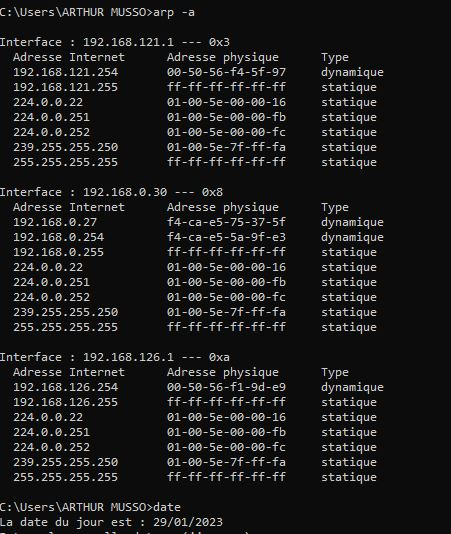

## arp -d
#### Cette commande permet de suprimmer le cache ARP.
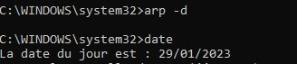

## encours1

## tracert @'ip'

## encours2

## netstat

## telnet

    
    <h5>TOP</h5>

