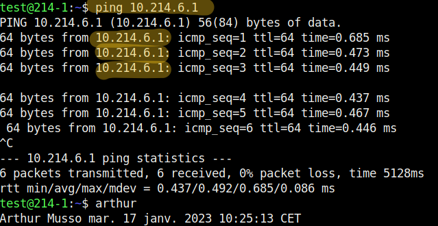

# DICTIONNAIRE DES COMMANDES RESEAUX ET OS SUR LINUX ET WINDOWS

## Présentation :
Dans ce doccument vous allez pouvoir retrouver toutes les commande réseau et OS les plus utilisé sous linux et windows.
## Sommaire :
* Commandes Réseaux
* Commandes OS

# Commandes Réseau
|LINUX | RACCOURCI | WINDOWS 
|-|-|-|
[ip addr show](#ip-addr-show)|ip a|if config
[ping '@ip'](#ping-@ip)||ping '@ip'
[ip addr add '@ip' dev "Nom De Votre Interface"](#ip-addr-add-ip-dev-nom-de-votre-interface)|ip a a ‘@ip’ dev "Nom De Votre Interface"|netsh interface ip set address name="interface" static '@ip' masque '@DNS'
[ip addr del ‘@ip’ dev "Nom De Votre Interface"](#ip-addr-del-ip-dev-nom-de-votre-interface)|ip a del ‘@ip’ dev "Nom De Votre Interface"|ipconfig /release
[dhclient](#dhclient)||ipconfig /renew
[ip link set up dev "Nom De Votre Interface"](#ip-link-set-up-dev-nom-de-votre-interface)|ip l s up dev "Nom De Votre Interface"|netsh int set int name="NomCarteReseau" admin=enable
[ip link set down dev "Nom De Votre Interface"](#ip-link-set-down-dev-nom-de-votre-interface)|ip l s down dev "Nom De Votre Interface"|netsh int set int name="NomCarteReseau" admin=disable
[ip route add default via ‘@ip’ dev "Nom De Votre Interface"](#ip-route-add-default-via-ip-dev-nom-de-votre-interface)|ip r a default via ‘@ip’ dev "Nom De Votre Interface"|route ADD 0.0.0.0 MASK
[ip route flush dev "Nom De Votre Interface"](#ip-route-flush-dev-nom-de-votre-interface)|ip r flush dev "Nom De Votre Interface"|
[mii-tool -w "Nom De Votre Interface"](#mii-tool--w-nom-de-votre-interface)||Pas de commande équivalente
[ip link show "Nom De Votre Interface"](#ip-link-show-nom-de-votre-interface)||ifconfig /all
[ip addr flush dev "Nom De Votre Interface"](#ip-addr-flush-dev-nom-de-votre-interface)|ip a flush dev "Nom De Votre Interface"|ipconfig /release
[ip neighbour](#ip-neighbour)|ip n|arp
[ip neighbour flush all](#ip-neighbour-flush-all)|ip n flush all|arp -d
[ifconfig](#ifconfig)||
[traceroute @'ip'](#traceroute-ip)||tracert @'ip'
[host](#host)||
[netstat](#netstat)||netstat
[telnet](#telnet)||telnet

# Commandes OS
| LINUX | RACCOURCI | WINDOWS
|-|-|-|
cd||
ls||

# Détail et utilisations des commandes :

## ip addr show
#### Affiche toute la configuration réseau (Adresse IP, nom des interfaces, etc…)

## ping @ip
#### Envoie des paquets icmp à l’adresse donnée. On peut l’utiliser pour voir si une machine est bien connectée au réseau.

## ip addr add '@ip' dev "Nom De Votre Interface"
#### Permet d’ajouter une adresse IP à votre machine. Avec ip a on peut voir que l’adresse IP a bien été ajoutée à l’interface demandé.

## ip addr del ‘@ip’ dev "Nom De Votre Interface"
#### Permet de supprimer une adresse ip précise.

## dhclient
#### dhclient fonctionne sur le modèle client-serveur. Un serveur qui détient la politique d’attribution des configurations IP envoie une configuration au client pour une durée donnée.

## ip link set up dev "Nom De Votre Interface"
#### Cette commande permet d’activer la carte réseau demandée.

## ip link set down dev "Nom De Votre Interface"
#### Cette commande permet d’activer la carte réseau demandée.

## ip route add default via ‘@ip’ dev "Nom De Votre Interface"
#### Cette commande permet d’éteindre la carte réseau demandée.

## ip route flush dev "Nom De Votre Interface"
#### Cette commande permet d’ajouter une route par défaut.

## mii-tool -w "Nom De Votre Interface"
#### 

## ip link show "Nom De Votre Interface"
#### 

## ip addr flush dev "Nom De Votre Interface"
#### 

## ip neighbour
#### 

## ip neighbour flush all
#### 

## ifconfig
#### 

## traceroute @'ip'
#### 

## host
#### 

## netstat
#### 

## telnet
#### 
