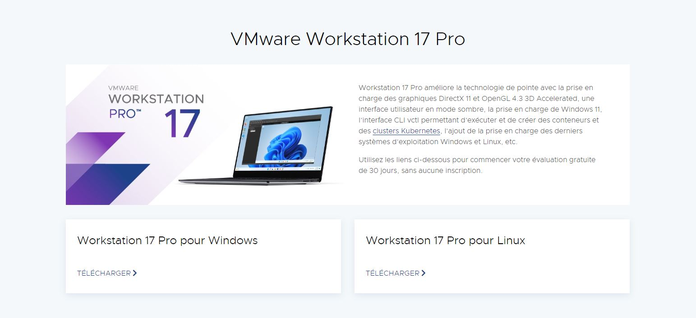
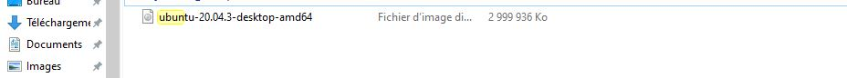
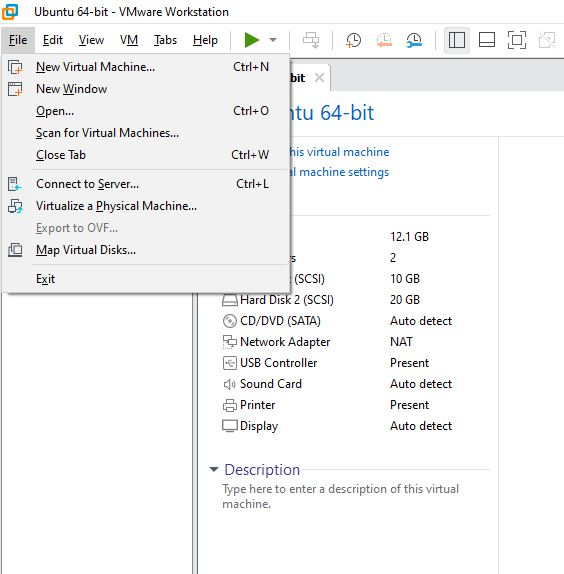
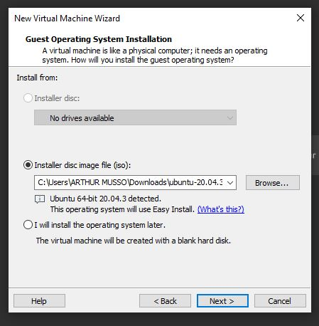
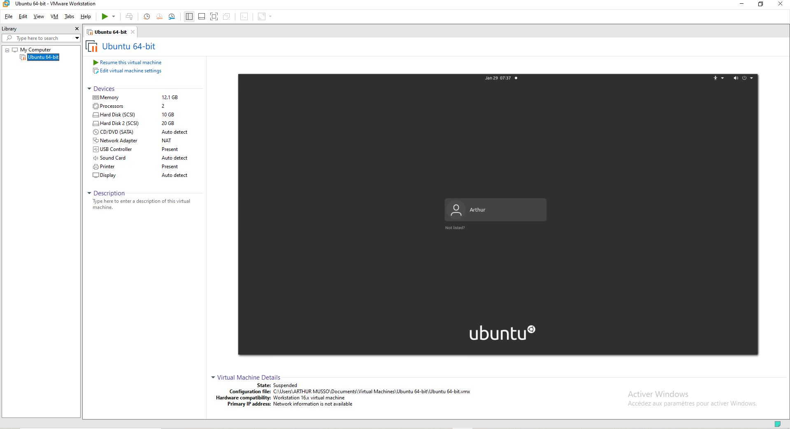
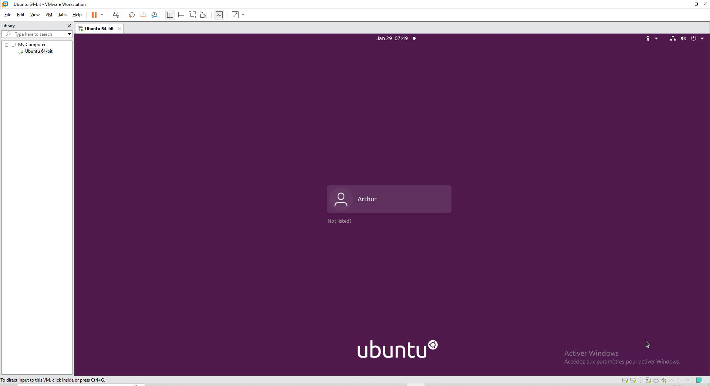
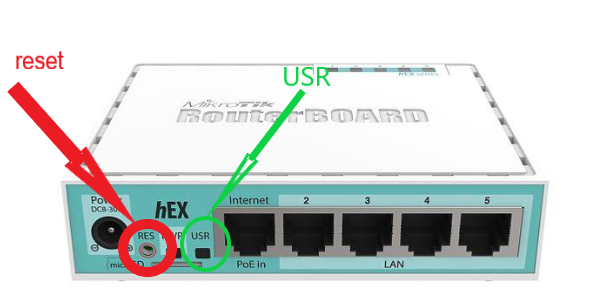

# Partie personelle Arthur Musso :

## Sommaire:
* [Installation d'une machine Virtuelle](#installation-dune-machine-virtuelle)
* [Installation d'un routeur Mikrotik](#installation-dun-routeur-mikrotik)

# Installation d'une machine Virtuelle
### 1. Pour l'instalation de la machine virtuelle j'ai choisis d'utilier VMware. Que j'ai télécharger a l'addresse : https://www.vmware.com/fr/products/workstation-pro/workstation-pro-evaluation.html.

### 2. Ensuite j'ai téléchargé l'image du système d'exploitation que je souhaitais utiliser (ici 'UBUNTU').

### 3. Pour créer la machine Virtuelle dans VMware. Je me suis rendu dans l'onglet -->File -->New Virtual Machine.

### 4. Puis j'ai selectionner l'image ISO téléchargé précédament. Et suivie la procédure d'instalation (alocation des ressources, choix des langues, etc...).

### 5. Et voici la Machine Virtuelle installé et prête à l'emploie.

# Installation d'un routeur Mikrotik

### Pour l'instalation du routeur Mikrotik j'ai procédé de la manière suivant:

### Dans un premier temps à l'arrière du routeur j'ai appuié sur le bouton RESET. Et tout en restant appuié j'ai branché l'allimentation et attendu que le témoin USR clignotte et que routeur fasse un bip. Afin d'éffacer les donnés et la configuration de la personne qui l'avait utilisé avant.

### Ensuite j'ai branché dans le port Internet le cable relié au réseau de l'IUT, dans le port 2 le cable relié au PC1 et dans le port 3 le cable relié au PC2.

### Sur le panneau de brassage je repère la prise que j'ai utiliser et je la relie au réseau de l'IUT.

### Sur le PC1 et PC2 je suprimme toutes les addresse IP de l'interface enp0s31f6. Puis je fais un dhclient afin de recevoir une nouvelle configuration.

### Je me rend sur le navigateur et dans la barre de recherche je tape l'addresse IP du routeur 192.168.88.1 .
### Je verifie que je suis bien en mode routeur et non en mode switch.

### Sur cette photo la configuration à été fait en mode automatique mais je l'ai aussi fait manuelement

### Pour cela j'ai rentré l'adresse ip : 192.168.88.1 et 192.168.88.2 avec la commande ip addr add 192.168.88.1 dev enp0s31f6.
### Puis pour la passerelle: 192.168.88.254 avec la commande ip route add default via 192.168.88.254 .

### Puis j'essaie de ping le PC1 a partir du PC2 Pour vérifier que tout fonctionne.

